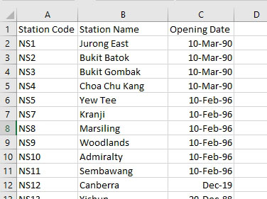
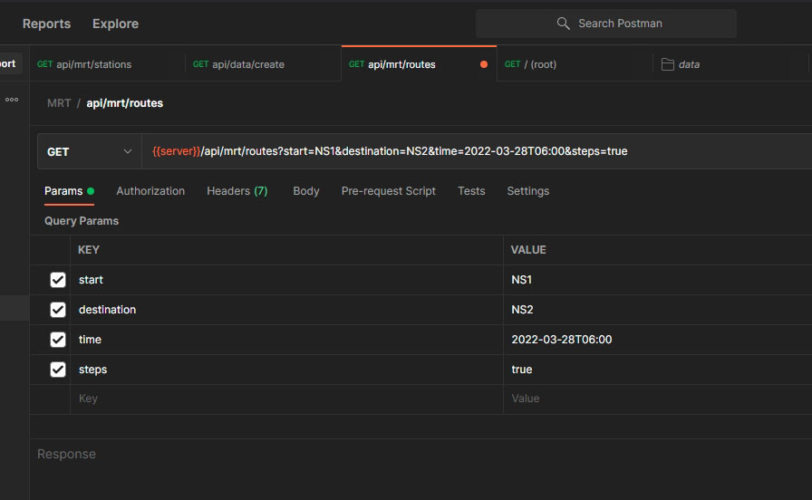
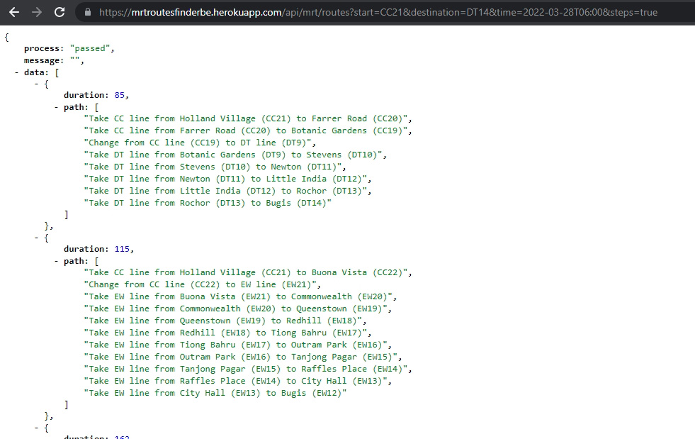
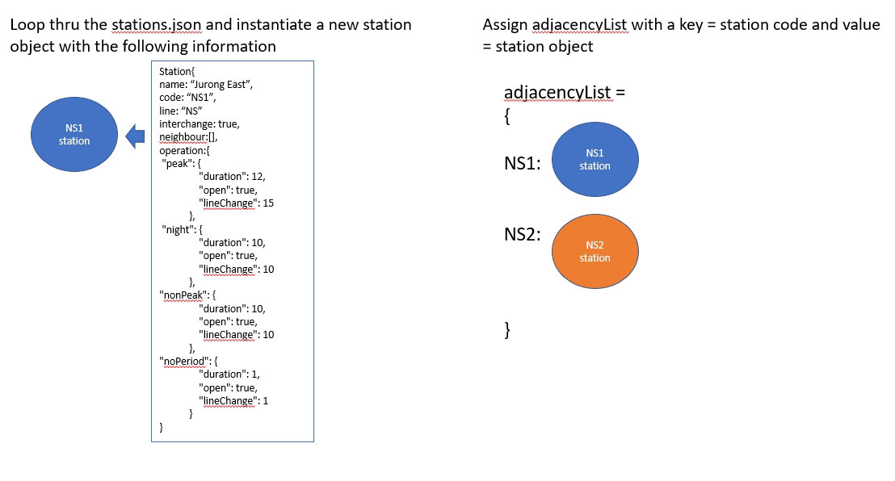
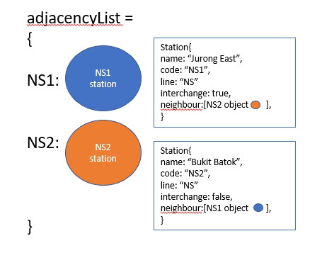
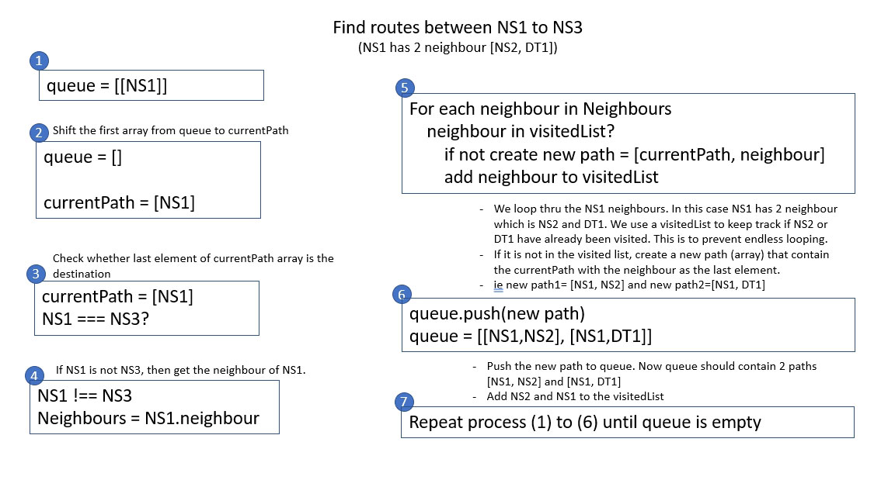
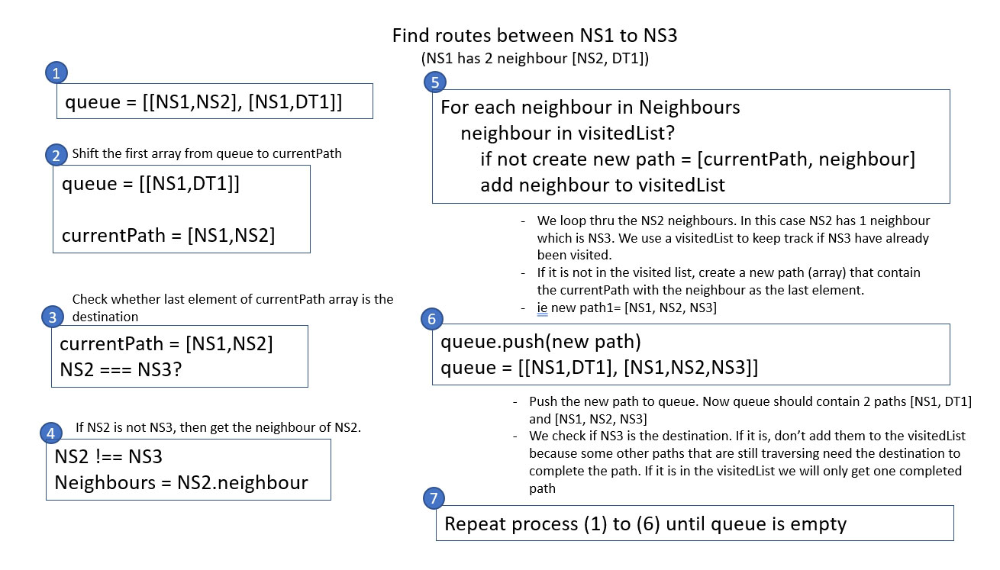
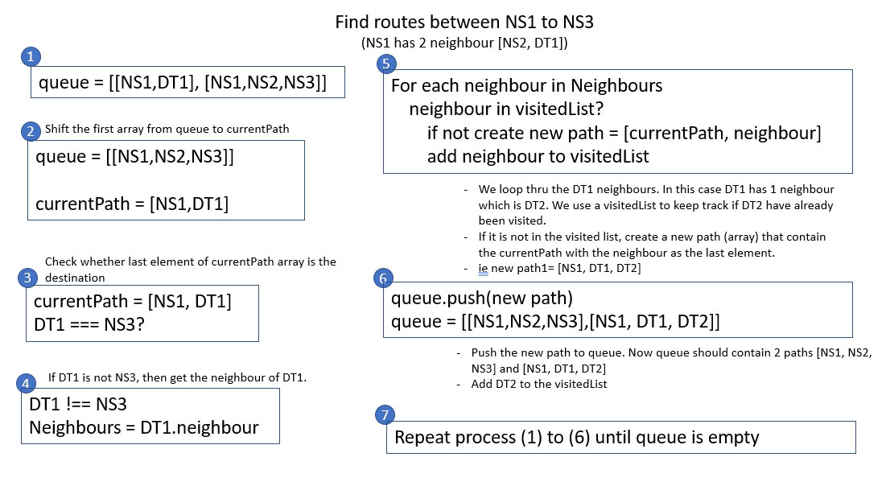
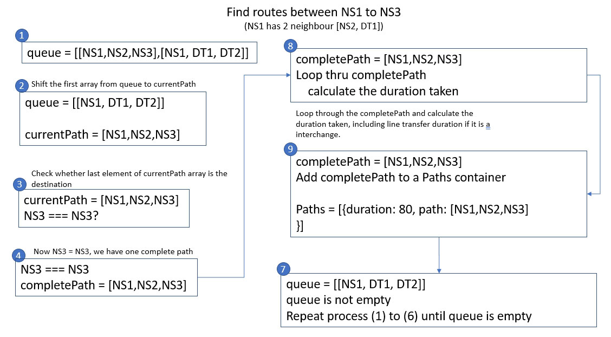
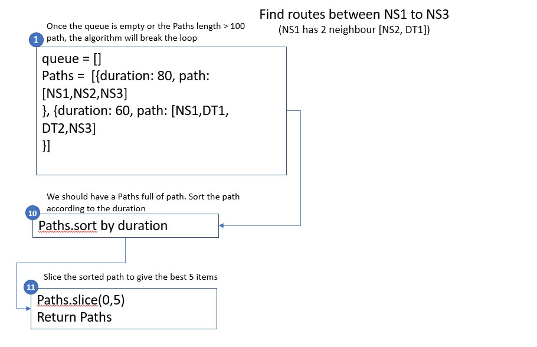

<br />
<div align="center">
   <h3 align="center">Singapore MRT Routes Finder</h3>
  <p align="center">
    Find the best routes given a start and destination stations 
    <br />
    <br />
    <a href="https://mrtroutesfinderbe.herokuapp.com/api/mrt/routes?start=CC21&destination=DT14&time=2022-03-28T06:00&steps=true">View Demo</a>
    <p>
  </p>
</div>

## About The Project

Singapore Mass Rapid Transit (MRT) has a very well connected network of stations across the country. This project is about helping the user find the best routes between two stations. Users can choose between the least number of stations or the shortest duration to get to the destination. The algorithm will determine whether a transfer between the six train lines is required to get the best result. A list of stations is provided in an csv file. The stations are list orderly by train line and station code.

### Requirements & Constraints

- to include total travel time in one or more Routes
- if no route available, should communicated clearly
- to expose a new method that accepts a source, destination and start time ("YYYY-MM-DDThh:mm" format, e.g. '2019-01-31T16:00')

- **peak hour (6am-9am & 6pm-9pm) (Mon - fri)**

  - NS and NE line (12min/station)
  - All others (10min/station)
  - Line change add 15min waiting time

- **night hour (10pm-6am) (Mon - Sun)**

  - DT, CG and CE lines not operating
  - TE line (8min/station)
  - All others (10min/station)
  - Line change add 10min waiting time

- **non-peak hour (all other timing)**
  - DT, TE line (8min/station)
  - All others (10min/station)
  - Line change add 10min waiting time

## Assumption

This project is build with the following assumption:

- the api use the 3 letter station code ie. NS1 as the start and destination param for the query. It is assume that any front end can supply such a code to the api. There isn't any sanity check or conversion if user supply station name instead of station code
- the supplied start time to the api for the query should be in '2019-01-31T16:00' format. There is no check on the format. It is assume that it is the responsibility of any front end to provide the correct format
- as there isn't any proper login system in place, this project will disgard the need for a jwt token to verify the use of the api

### Built With & Packages Used

This project is build with express and node.js. The packages used in this project are listed below:

#### Dependencies

- csvtojson (for converting csv file to json)
- moment (for dealing with time)

#### Development dependencies

- nodemon
- jest
- supertest

## Getting Started

### Run Locally

Clone this repository to a local directory then run the npm install command in your local app directory to install the dependencies that declared in your package.json file.

```
npm install
```

Make sure the data folder contain _StationMap.csv_. The other two json files _interchange.json_ and _stations.json_ are essential for this app to run successfully. These json files are generated by _StationMap.csv_ using an api endpoint. Please refer to API Endpoint section below for more info.

#### StationMap.csv

This csv file contain the Mrt Station Code, Station Name and Opening Date. Station Code and Station Name are the 2 columns important for this project. The stations are list ordely by train line and in sequence. You can add in new station following that order. Order is important because the graph algorithm will connect the station together using the order maintained in the csv file.



#### Starting the app server

Run the below command to start the server locally. The server is listening to PORT 5000

```
npm run dev
```

#### Postman

Use Postman to test out the api



### Deploy to heroku

- this repo contain a Procfile that is require for heroku deployment
- make sure package.json inclue these line:
  ```json
    "engines": {
    "node": "16.14.2"
  }
  ```
- make sure the start script is "node server.js"
  ```json
    "scripts": {
    "start": "node server.js",
    "dev": "nodemon server",
    "test": "jest --watch"
  },
  ```
- [install heroku cli](https://devcenter.heroku.com/articles/heroku-cli)
- [follow the section on Deploy your application to Heroku](https://devcenter.heroku.com/articles/deploying-nodejs)
- once deploy test out the api using this api endpoint `<YOUR HEROKU WEB ADDRESS>api/mrt/routes?start=CC21&destination=DT14&time=2022-03-28T06:00&steps=true`
- on chrome install JSONVue extension to view the pretty print json data as shown
  

## How to Use

#### API Endpoint

Data Routes

- _/api/data/create_ - use this route to generate stations.json and interchange.json file. If file already exisit in data folder, it will overwrite existing file. Regenerate the files if you add more stations to the StationMap.csv file.

Mrt Routes

- _/api/mrt/routes?start=NS1&destination=NS2_ - the params after the question mark `start=NS1` and `destination=NS2` query the api for routes that start with MRT station code "NS1" to destination station code "NS2".
- Missing the `start` or the `destination` params will return following result:
  ```json
  {
    "process": "failed",
    "message": "missing query parameter",
    "data": []
  }
  ```
- If a station code supply is not in the Mrt station list ie. NS100 or ABC100, the query will return an empty array with the below message.
  ```json
  {
    "process": "passed",
    "message": "no routes found between the 2 stations",
    "data": []
  }
  ```
- _/api/mrt/routes?start=NS1&destination=NS2&time=2022-03-28T22:00_ - the time param must be in the format of `2022-03-28T22:00`. This time param is use to determine the peak, non-peak or night period condition. Supplying a time param will return route with a `durarion` key indicating the total time taken. If time param is omitted, the return route will have the same `duration` key indicating `the total number of stations to destination excluding the start station`.

  ```json
  //end point with time param included

      "process": "passed",
      "message": "",
      "data": [
          {
              "duration": 12,
              "path": [
                  "NS1",
                  "NS2"
              ]
          },
  ```

  ```json
  //end point without time param included

      "process": "passed",
      "message": "",
      "data": [
          {
              "duration": 1,
              "path": [
                  "NS1",
                  "NS2"
              ]
          },
  ```

- _/api/mrt/routes?start=CC21&destination=DT14&time=2022-03-28T06:00&steps=true_ -the `steps=true` param return the route in action steps instead of station.

  ```json
  //end point without steps param, below shows the station code

    "process": "passed",
    "message": "",
    "data": [
        {
            "duration": 85,
            "path": [
                "CC21",
                "CC20",
                "CC19",
                "DT9",
                "DT10",
                "DT11",
                "DT12",
                "DT13",
                "DT14"
            ]
        },
  ```

  ```json
  //end point with steps param, below shows the action steps

    "process": "passed",
    "message": "",
    "data": [
        {
            "duration": 85,
            "path": [
                "Take CC line from Holland Village (CC21) to Farrer Road (CC20)",
                "Take CC line from Farrer Road (CC20) to Botanic Gardens (CC19)",
                "Change from CC line (CC19) to DT line (DT9)",
                "Take DT line from Botanic Gardens (DT9) to Stevens (DT10)",
                "Take DT line from Stevens (DT10) to Newton (DT11)",
                "Take DT line from Newton (DT11) to Little India (DT12)",
                "Take DT line from Little India (DT12) to Rochor (DT13)",
                "Take DT line from Rochor (DT13) to Bugis (DT14)"
            ]
        },
  ```

- _/api/mrt/stations_ - generate all the stations available. It is useful for dropdown list in the frontend app.

  ```json

    "process": "passed",
    "message": "",
    "data": [
        {
            "NS1": "(NS1) - Jurong East"
        },
        {
            "NS2": "(NS2) - Bukit Batok"
        },
        {
            "NS3": "(NS3) - Bukit Gombak"
        },
        {
            "NS4": "(NS4) - Choa Chu Kang"
        },
        {
            "NS5": "(NS5) - Yew Tee"
        },
  ```

## How it works

### Folder Structure

The main entry point is the server.js, but the main express apps functionality is destructured into app.js to facilitate the test tool to access these functions without conflicting with the server app listener. The app.js have 2 type of routes namely "data"`/api/data` and "mrt"`/api/mrt`. The "data" routes let users access the process dealing with the data generating the stations.json and interchangel.json files. The "mrt" routes deal with querying the data and looking for paths from start to a destination station.

#### routers

This folder contained two routers, the "dataRouter" and "mrtRouter". As mentioned earlier, app.js have two routes and these individual routers further split the routes into endpoints to direct the user to a specific service provided by the app. The routers also serve as a linkage to the controller where the main logic is.

#### controller

This folder contained two controllers, the "dataController" and "mrtController". These controllers have functions that collect and direct data and execute functions located throughout the app and specific folder. The `dataController` has only one role:

- Read the data from the StationMap.csv file.
- Manipulate the data into a particular format.
- Generate stations.json and interchange.json.

```json
//in stations.json, each station contain the following information
    {
        "Station Code": "NS1",
        "Station Name": "Jurong East",
        "Opening Date": "10 March 1990",
        "interchange": true,
        "operation": {
            "peak": {
                "duration": 12,
                "open": true,
                "lineChange": 15
            },
            "night": {
                "duration": 10,
                "open": true,
                "lineChange": 10
            },
            "nonPeak": {
                "duration": 10,
                "open": true,
                "lineChange": 10
            },
            "noPeriod": {
                "duration": 1,
                "open": true,
                "lineChange": 1
            }
        }
    },
```

```json
//in interchange.json, list all the interchange in this format
    {
        "Station Code": "CE1",
        "Station Name": "Bayfront",
        "Opening Date": "14 January 2012"
    },
    {
        "Station Code": "DT16",
        "Station Name": "Bayfront",
        "Opening Date": "22 December 2013"
    },
```

The `mrtController` have two function _getAllRoutes_ and _getAllStationsName_.

- The `getAllRoutes`, given a set of conditions and parameters, work with the graph data structure to give all the possible routes linking the start and destination stations
- The `getAllStationsName` generate a list of object that contains the station name and code

#### utils

The utils folder contains the general helper functions for the controller to use. The generateData.js includes the primary function to read the csv file and manipulate the data.

#### test

The test folder contain test to check the mrt querying endpoint producing the require outcome.

#### graph

The graph folder contain the graph data structure, the main logic to search for path between the start and destination station

## The Graph Data structure

### Building the graph

In station.js, the `Station` class have the following properties and method.

```js
module.exports = class Station {
  constructor(code, name, interchange) {
    this.name = name;
    this.code = code;
    this.line = code.substr(0, 2);
    this.interchange = interchange;
    this.neighbour = [];
    this.operation = {
      peak: {},
      night: {},
      nonPeak: {},
      noPeriod: {},
    };
  }

  //check whether the mrt station is open given a particular period of the day
  isOpen(period) {
    return this.operation[period]["open"];
  }

  //check the duration take to travel to this station
  //duration varies depend on the period of the day
  duration(period) {
    return this.operation[period]["duration"];
  }

  //check the linechange duration take to travel to an interchange station
  //duration varies depend on the period of the day
  lineChange(period) {
    return this.operation[period]["lineChange"];
  }

  //check if this station is an interchange
  isInterchange() {
    return this.interchange;
  }

  //add neighbour station connected to this station
  addNeighbour(station) {
    this.neighbour.push(station);
    station.neighbour.push(this);
  }

  //check if specific mrt station is a neighbour of this station
  neighbourExist(stationCode) {
    const neighboursLabel = this.getNeighboursLabel();
    return neighboursLabel.includes(stationCode);
  }

  //get an array of neighbour connected to this station in mrt code
  //ie. [NS1, NS3]
  getNeighboursLabel() {
    return this.neighbour.map((station) => {
      return station.code;
    });
  }
};
```

The buildGraph.js first read and instantiate each station from stations.json into a station object using the `Station` class. Then it add each station to the `MRTGraph` adjacency list.



Then the buildGraph loop through the `stations.json` file again, following the sequence connect the station in the adjacencyList by using the `Station` class `addNeighbour` method.
The `addNeighbour` method add the station object to the current station and also add the current station object to the "added station" so that 2 station maintain the same connection.

```js
  addNeighbour(station) {
    this.neighbour.push(station);
    station.neighbour.push(this);
  }
```



Throughout the connection, the building process will check if a station is an interchange. If it is, it will find corresponding related stations and add them to each other neighbour.
ie. NS27 will have neighbour [CE2, TE20], CE2 will have neighbour [NS27, TE20] and TE20 will have neighbour [NS27, CE2]

```json
    {
        "Station Code": "NS27",
        "Station Name": "Marina Bay",
        "Opening Date": "4 November 1989"
    },
    {
        "Station Code": "CE2",
        "Station Name": "Marina Bay",
        "Opening Date": "14 January 2012"
    },
    {
        "Station Code": "TE20",
        "Station Name": "Marina Bay",
        "Opening Date": "31 December 2021"
    },
```

### Traversing the graph to find the routes

- The method use is BFS. First the graph `getPossiblePaths` method check whether start and destination station code exist. If it isn't return an empty path.
- Then it check whether the start or destination station is operating. We use the `Station` class `isOpen(period)` method. If station is not operating then return an empty path

```js
  isOpen(period) {
    return this.operation[period]["open"];
  }

  // passing a period "peak", "night", "nonPeak" or "noPeriod" we can get the
  //open state.

  //   "operation": {
  //     "peak": {
  //         "duration": 12,
  //         "open": true,
  //         "lineChange": 15
  //     },
  //     "night": {
  //         "duration": 10,
  //         "open": true,
  //         "lineChange": 10
  //     },
  //     "nonPeak": {
  //         "duration": 10,
  //         "open": true,
  //         "lineChange": 10
  //     },
  //     "noPeriod": {
  //         "duration": 1,
  //         "open": true,
  //         "lineChange": 1
  //     }
  // }
```

- the graph uses a FIFO queue system to keep track of the path. The queue is an array that contains arrays.
- The below gives a brief explaination of how the bfs work using the queue and visitedList
  

  

  

  

  

## What I could do better

- checking the start time format using regular expression
- return back more proper message if a route cannot be found or if a start or destination station cannot be found in our stations list
- cache the query result using mongo or redis so that the result can be return quickly

## Reference

[The breadth-first search algorithm](https://www.khanacademy.org/computing/computer-science/algorithms/breadth-first-search/a/the-breadth-first-search-algorithm)

[Using Breadth First Search with Graphs in Coding Interviews](https://www.youtube.com/watch?v=nKnlhhz2huE)

[Graph Search Algorithms in 100 Seconds - And Beyond with JS](https://www.youtube.com/watch?v=cWNEl4HE2OE&t=523s)

[Graph Data Structure 4. Dijkstra’s Shortest Path Algorithm](https://www.youtube.com/watch?v=pVfj6mxhdMw)

[Graph Coding Question - All Paths From Source To Target (LeetCode)](https://www.youtube.com/watch?v=CYnvDzMprdc&t=370s)

[graph-data-structure package](https://www.npmjs.com/package/graph-data-structure)

[KSP - K Shortest Path package](https://www.npmjs.com/package/k-shortest-path)

[graph-route-finder package](https://www.npmjs.com/package/graph-route-finder)
